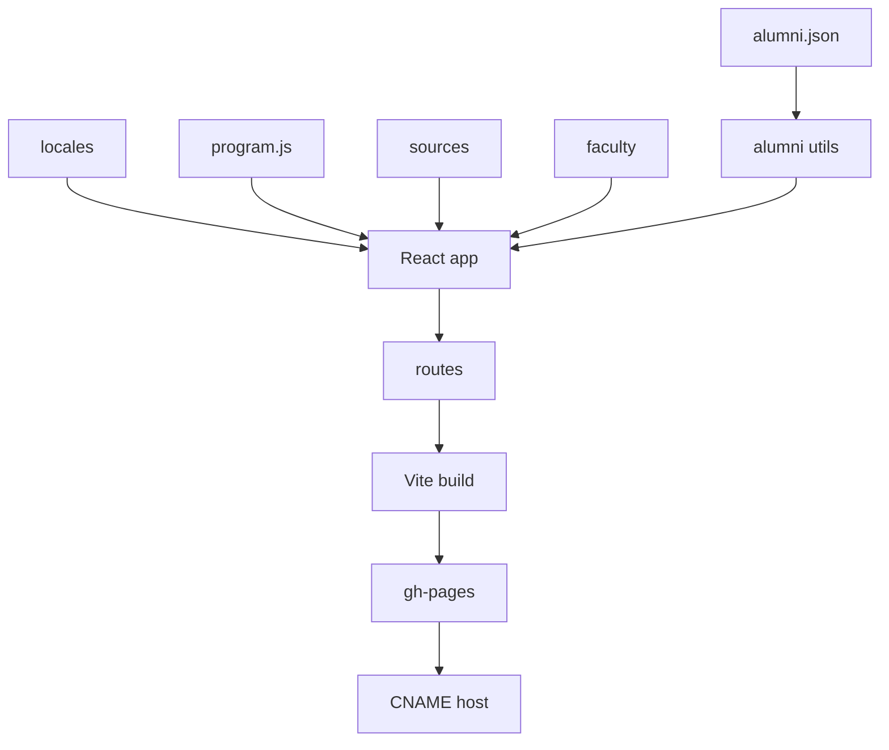

A mentor and a student, one Mac, a city outside the window. The banner is illustration only — no live UI, no HUD, no title overlay.

# SCL Landing Page

**An independent multilingual archive for depa's Smart City Leadership programme — roster, sources, and method, not a brochure.**

[](LICENSE)

**Author.** [Non Arkaraprasertkul](https://github.com/Nonarkara) (Nonarkara) — architect, urban anthropologist, civic-studio practice at **Axiom X Co., Ltd.**, Bangkok.

Independent. Written for a **Thai–English** audience (this tree also ships a Chinese locale). **Not** an official depa, Ministry, or municipal product.

หน้าแลนดิ้งอิสระของหลักสูตร Smart City Leadership — คลังรายชื่อ แหล่งอ้างอิง และวิธีคิด ไม่ใช่โบรชัวร์ ผู้อ่านเป้าหมายคือคนไทยและคนอังกฤษด้วยกัน

Public host configured in this repo: [scl.nonarkara.org](https://scl.nonarkara.org/). Official programme pages stay on [depa.or.th](https://www.depa.or.th/en/article-view/smart-city-leadership-program-6-scl-6).

---

## What this is

A static **React 19 + Vite** site for people who want to *read* SCL instead of being sold it: six published cohorts, a source-linked alumni directory, faculty notes, a methodology page with citations, a public-link archive, a photo gallery, and a FAQ.

Counts below are from **this tree**, not from a live API.

| In this repo | Count | Where |
|---|---|---|
| Alumni roster records | 306 across 6 cohorts | [`src/data/alumni.json`](src/data/alumni.json) |
| Provinces parsed from those lines | 53 of 77 | [`src/utils/alumni.js`](src/utils/alumni.js) |
| Faculty profiles | 10 | [`src/pages/Faculty.jsx`](src/pages/Faculty.jsx) |
| FAQ entries | 52 | [`src/data/faqData.js`](src/data/faqData.js) |
| Source-archive URLs | 31 | [`src/data/sclSourceArchive.js`](src/data/sclSourceArchive.js) |
| Locales | Thai, English, Chinese | [`src/locales/`](src/locales/) |

Programme constants the site uses (from depa's published SCL #6 outline, encoded in [`src/data/program.js`](src/data/program.js)): 7 days, 42 hours, 30+ speakers, fee THB 62,000. Application and session dates in that file are for cohort 6 — they are not a promise that a new intake is open.

Routes in [`src/App.jsx`](src/App.jsx):

| Path | What it is |
|---|---|
| `/` | Home — hero, overview, journey, voices |
| `/curriculum` | Six-module outline |
| `/methodology` | Six cited frameworks + four sibling tools |
| `/faculty` | Ten profiles with source-linked bios |
| `/alumni` | Searchable directory, sector/domain filters, Thailand map |
| `/gallery` | Cohort photo archive |
| `/sources` | Verified public URLs for cohorts 1–6 |
| `/faq` | Eligibility, logistics, certification, partnerships |

**This repo is not**

- The official depa communications channel, application form, or certificate issuer.
- A city ranking, score, or black-box index. (Sibling studio work lives in [SLIC-Index](https://github.com/Nonarkara/SLIC-Index) and [sciti](https://github.com/Nonarkara/sciti).)
- A dump of API keys, analytics tokens, or private rosters.

Related studio tools linked from the methodology page: [SCITI](https://sciti.nonarkara.org/), [SLIC](https://slic.nonarkara.org/), [ASCN workbench](https://ascn.nonarkara.org/), [Solomon Islands write-up](https://solomon.nonarkara.org/).

---

## Philosophy

**Fork the method, not the secrets.**

The portable part is already in the files: a static Vite app, locale JSON, a roster you can grep, classifiers that show their rules, and a source archive that prefers a working public URL over a social post. Copy that shape for another executive programme. Do not copy anyone else's deploy token, Plausible domain if it is not yours, or a private spreadsheet of names. If a contribution only works by pasting a secret, it does not belong here.

**One Mac.** `npm install` and `npm run dev` are the whole studio. There is no database server, no ranking farm, and no vendor CMS. GitHub Actions builds `dist/` and pushes the `gh-pages` branch. If you cannot run it on the computer in front of you, you are overcomplicating it.

**No black-box rankings.** This site is a directory and an archive. Alumni rows come from depa's published cohort lists. Province and sector counts are derived in [`src/utils/alumni.js`](src/utils/alumni.js) from the Thai source line — you can read the patterns. Names stay in Thai, as published. Do not add a "top city" or "best alumnus" score the reader cannot inspect.

**Thai–English as the audience.** Write so a Bangkok operator and an English-speaking learner can use the same surface. The default language is Thai; English is the fallback; Chinese is a third locale in this tree. Toggle language; do not hide a gap.

Company: **Axiom X Co., Ltd.** Author: **Non Arkaraprasertkul** ([@Nonarkara](https://github.com/Nonarkara)).

---

## Ethical use

This page exists so learners and city leaders can check a public record. It is not a kit for harvesting names, impersonating depa, or ranking people.

**Do**

- Keep the official depa article as the source of record for applications, fees, and dates.
- Attribute alumni lines to the published cohort announcements linked in [`src/data/program.js`](src/data/program.js).
- Leave names in Thai unless you are quoting a source that already romanises them.
- Label derived analytics (sector, domain, province) as parsed from the roster, not as a certified census.
- Store any future token as an environment variable. Never commit `.env`.

**Do not**

- Imply depa, the Ministry of Digital Economy and Society, or a municipality publishes this repository.
- Scrape the directory for marketing, lobbying, or surveillance.
- Ship mock alumni as live, or hide an empty roster behind a success state.
- Invent awards, placement rates, or a live URL that is not in `public/CNAME` or a depa page.
- Turn this archive into a black-box ranking of cities, cohorts, or people.
- Commit API keys, analytics tokens, or private contact lists.

If you are unsure whether a string is a secret, it is — leave it out.

---

## How to use / learn

```bash
git clone https://github.com/Nonarkara/scl-landing-page.git
cd scl-landing-page
npm install
npm run dev          # Vite → http://localhost:5173
npm run lint
npm run verify:assets
npm run build        # production bundle in dist/
```

A learner path that matches the code:

1. Read [`src/data/program.js`](src/data/program.js) — cohort constants and official depa URLs.
2. Open `/alumni` and follow a name back to [`src/data/alumni.json`](src/data/alumni.json), then to the batch announcement.
3. Read [`src/utils/alumni.js`](src/utils/alumni.js) to see how province, sector, and domain are classified (rules in the file, not a model).
4. Walk `/methodology` and click a citation. The six frameworks and four sibling tools are in [`src/components/Methodology.jsx`](src/components/Methodology.jsx).
5. Open `/sources` and confirm a URL from [`src/data/sclSourceArchive.js`](src/data/sclSourceArchive.js).
6. Switch TH / EN / CN in the navbar. Copy lives in [`src/locales/`](src/locales/).

| If you want… | Open |
|---|---|
| Routes and metadata | [`src/App.jsx`](src/App.jsx) |
| Home composition | [`src/pages/Home.jsx`](src/pages/Home.jsx) |
| Curriculum modules | [`src/components/Curriculum.jsx`](src/components/Curriculum.jsx) |
| Faculty bios | [`src/pages/Faculty.jsx`](src/pages/Faculty.jsx) |
| Deploy | [`.github/workflows/deploy.yml`](.github/workflows/deploy.yml) |

Stack in this tree: React 19, Vite, React Router 7, i18next, Leaflet, custom CSS (no Tailwind). Pages deploy from `main` via GitHub Actions. `public/CNAME` is `scl.nonarkara.org`.

---

## System diagram

Short labels so GitHub Mermaid does not clip.



JSON and locales are the source of truth. The map and insights only show what the roster parser can defend. depa remains the record for who was admitted.

---

## License / contributing

This repository is licensed under the [MIT License](LICENSE). Copyright © 2026 **Non Arkaraprasertkul / Axiom X Co., Ltd.**

Reuse the site, the classifiers, and the prose with attribution. MIT here does not relicense depa programme content, alumni names, faculty likenesses, press articles, or the sibling tools named above.

**Contributing.** Open a pull request against `main`.

- Keep every public number traceable to a file in this tree or a working official URL.
- Do not add secrets, invented metrics, awards, or a fake live host.
- Preserve Thai names on the roster unless a published source already romanises them.
- Fixes to ethics, broken source links, and stale cohort constants are as welcome as new pages.

If you fork this method for another public programme, the studio would like to see it.
